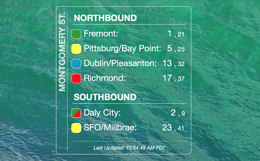

#Übersicht BART Widget

An [Übersicht](http://tracesof.net/uebersicht) widget (inspired by [this](https://github.com/joshuaswilcox/mbta-widget) widget). It displays the next two times of departure for each BART (Bay Area Rapid Transit) train leaving a particular stop.

##Installation

* Unzip and drag the bart.widget folder into your Übersicht widgets folder

* Once installed, you will need to fill in your `STOP_ID` with an ID from [here](http://api.bart.gov/docs/overview/abbrev.aspx).

* You can also change the sorting method under the `update` function